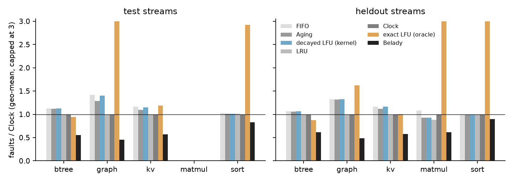
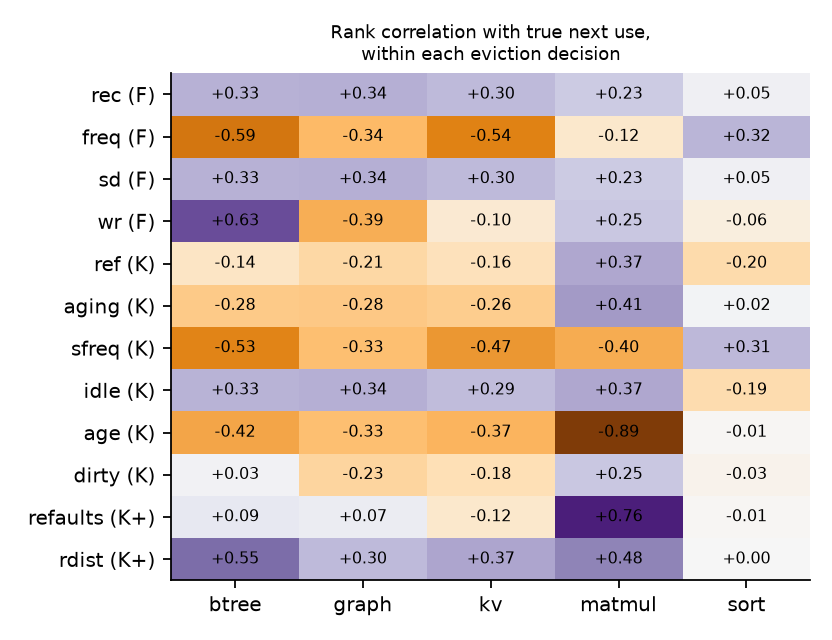
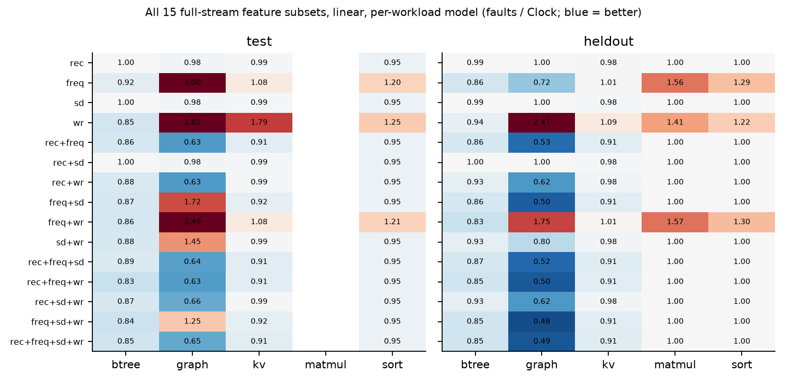
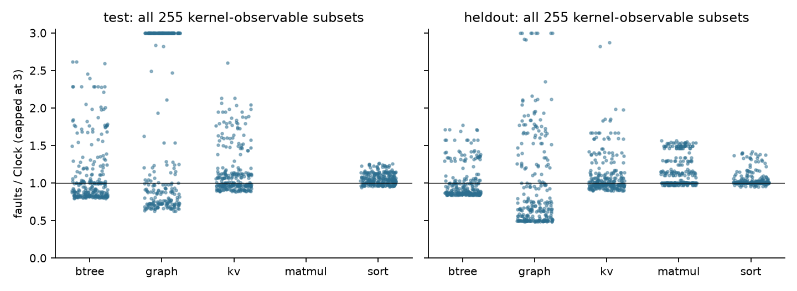
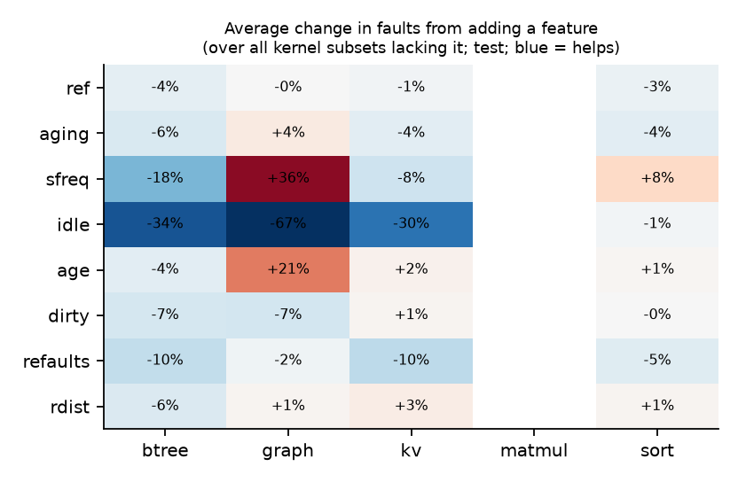

# Learned Page Replacement for xv6 — Study on the `traces2` Streams

**Status:** complete study on the verified seed/variant streams (`traces2/`).
Supersedes the numbers in `report/ML_TESTING_REPORT.md`, which was measured
on the older `traces/` captures — two of which turned out to be wrong (§2.4).
That report is kept for history; nothing in this one depends on it.

<!-- SUMMARY -->

---

## 1. Question and constraints

The research question: **can a learned model replace the classical page-
replacement policy of an operating system?** The plan is to show it in
xv6-riscv first — train on memory workloads, integrate the model into the
kernel, measure it — as a precursor to doing the same in Linux.

Three constraints shape every design decision below.

1. **xv6 has no floating point.** Nothing learned can run in the kernel
   unless it can be computed in integers. All training here runs on the host
   (Python/PyTorch); the question of what could run *inside* the kernel is
   answered separately (§8).
2. **A kernel does not see memory accesses.** A load or store is handled
   entirely by the MMU. What the kernel sees is (a) page faults and (b) the
   accessed (`PTE_A`) and dirty (`PTE_D`) bits the hardware sets in the page
   table, which the kernel can read and clear when it scans pages. This is
   equally true of Linux for anonymous memory. So a model that needs "how
   many times was this page touched" or "how long since its last access, in
   accesses" cannot be deployed as trained; it needs information the kernel
   never has. This study therefore trains every model on three feature
   tiers (§4) — what only an oracle trace has, what a kernel can observe,
   and what a kernel can cheaply book-keep — and treats the first as an
   ablation (an upper bound on what information is worth), not as a
   deployable result.
3. **Decisions compound.** Which page is evicted changes every later fault,
   so policies can only be compared by replaying complete reference streams,
   never by per-reference prediction accuracy. All results are fault counts
   from full replays.

## 2. How the traces were made

### 2.1 The workloads

Five native xv6 programs (`user/*bench.c`), each built so that no single
fixed heuristic — pure recency, pure frequency, pure sequential — wins
trivially (`docs/workloads.md`):

| Workload | What it models | Why it isn't trivial for one policy |
|---|---|---|
| `btreebench` | A B+tree over 4 KB node pages (SQLite pager stand-in): insert, point lookup, range scan, mixed; optional write-ahead log | Lookups re-hit the same upper nodes (frequency), inserts touch fresh leaves once (recency), scans walk the leaf chain (sequential) |
| `kvbench` | An open-addressing hash table with Zipfian keys (Redis stand-in), YCSB-style modes A (50/50 r/w), B (95/5), C (read-only), D (read-latest), F (read-modify-write); optional incremental rehash and heavy-tailed value sizes | The hot key set rotates over time, so old-hot pages must go cold and new-hot ones warm up |
| `graphbench` | BFS and fixed-point PageRank over a synthetic scale-free graph (CSR layout) | BFS visits pages in data-dependent frontier order; PageRank revisits hub vertices every iteration |
| `sortbench` | Bottom-up merge sort | Deliberately sequential — a calibration workload with little headroom |
| `matmulbench` | Integer matrix multiply, naive (ijk) vs. blocked | A locality-contrast pair; tiny working sets |

### 2.2 What a trace records

Each workload routes every access to its data arena through one accessor
(e.g. `bt_node()`, `graph_trace()`), which calls
`vmbench_trace_ref(vpn, access)` and emits one line per logical access:
`R <vpn>` if the access only read the page, `W <vpn>` if it modified it. The
access argument has no default, so an untraced or unmarked call site does not
compile. The stream is a **complete reference string** — every touch, not just
faults — which is what an optimal (Belady) label needs: a page that stays
resident and is re-touched without faulting is still recorded. Only the arena
is traced; the process's own code and stack pages (3–9 always-hot frames per
run) are not.

The trace is written to a file inside xv6's file system (one `write()` per
~4 KB, rather than a character at a time over the console) and extracted on
the host afterwards.

### 2.3 How the stream set was collected (AU5TRA, commits `2d89a64`–`e6bfafe`)

A reference string does not depend on how much memory the run is given —
verified: every capacity of a workload in the older `traces/sweep` campaign
produced a byte-identical trace. So each stream needs **one traced run at a
generous margin** (8,000 resident frames, above every footprint), not a
capacity sweep; capacities are then chosen in simulation.

* `tools/make_stream_manifest.py` defines the matrix: 25 variants —
  kv ×7, btree ×5, graph ×4, sort ×3, matmul ×6 — and seeds per variant
  (5, or 3 for the long graph and sort runs; matmul's seed only fills in matrix
  values, so it has one stream per variant). **89 streams**, plus 22 `-rep`
  determinism repeats.
* `tools/run_stream_lanes.sh` runs them in 6 parallel lanes, each in its own
  copy of the tree; every run gets a freshly built `fs.img`.
* A stream counts as collected only if the run printed PASS, the log carries
  `TRACEEND refs=N bytes=M`, and the extracted file has exactly N lines and M
  bytes, every one `R <vpn>` or `W <vpn>`.
* `tools/check_streams.py` then checks that every repeat is byte-identical to
  its original, every trace is under 90% of xv6's maximum file size, and the
  seeds of a variant give different strings.

All 111 runs passed; all 22 repeats were byte-identical. Deliberately left
out: kvbench's TTL mode (expiry reads `uptime()`, so the string depends on
timing), lzwbench (its string exceeds xv6's maximum file size), and matmul
seeds (no effect).

### 2.4 Why the older `traces/` captures are not used

Checking the dataset against the kernel's own counters and against host
re-executions of the workloads (commit `9d36525`) found two of the six old
captures wrong:

* **graphbench** traced only the edge array. BFS's `visited[]` checks and
  PageRank's `rank[]`/`next_rank[]` updates — the random, hub-driven accesses
  the workload exists for — were never recorded: 667 of 2,000 arena pages
  and 57% of the references. FIFO over the old trace could not reproduce the
  kernel's eviction count (168,551 vs. 2,035,488).
* **lzwbench**'s trace hit xv6's maximum file size (67,381,296 of 67,382,272
  bytes) and silently lost its tail — about 58% of the run is present — while
  the run still printed PASS.

The other four old traces are page-for-page identical to their `traces2`
counterparts (btree-mixed-s1, kv-A-s1, sort-n40000-s1, matmul-*96), just
without read/write marks. Consequences for the earlier report: its graphbench
result ("`global_frequency` beats Clock by 4.3%") and its lzwbench result
("hand-written LFU −24% vs. Clock") were measured on these two broken traces
and should not be cited. With the fixes, the new graph traces match a host
re-execution reference for reference, FIFO over them reproduces the kernel's
evictions with 3–5 untraced frames (−0.1%), and a dirty-tracking replay of the
W marks predicts the kernel's own `page_writes` (btree 12,329 inside
[12,168, 12,438]).

`traces/` is still used for what it is good at — its `sweep/` campaign holds
real kernel fault counts at six resident limits per workload, which is how
the simulator's agreement with the kernel is established — but not for ML.

## 3. The dataset (`traces2/ML`)

`tools/stream_dataset.py prepare` turns the 89 streams into:

* `<stem>.npz` — three aligned arrays, one entry per reference: `vpn`
  (uint32), `write` (bool), and `next_use` — the distance, in references, to
  the next access of the same page (`0xFFFFFFFF` if never). `next_use` is the
  quantity Belady's algorithm evicts by; it is computed from the recorded
  future and is used **only as a training label and for the Belady
  baseline, never as a model input**.
* `SPLITS.tsv` — fixed splits, so every experiment reports against the same
  data:
  * **held-out**: whole variants never seen in training — `kv-F`,
    `btree-scan`, `graph-bfs2000`, `sort-n60000`, `matmul-*128`. This tests an
    unseen *behaviour*.
  * within every other variant: last seed **test**, second-to-last
    **validation**, the rest **train**. This tests an unseen *run* of a
    familiar behaviour.
* `baselines.tsv` — FIFO, LRU and Belady fault counts at six capacities (5,
  10, 15, 20, 25, 30% of the stream's own distinct pages), simulated from
  empty memory.

| Split | Streams | References |
|---|---|---|
| train | 41 | 45.5M |
| val | 15 | 23.6M |
| test | 15 | 23.6M |
| held-out | 18 | 30.6M |

Per variant (means over its streams):

| Workload | Variant | Streams | Splits | References | Distinct pages | Write share |
|---|---|---|---|---|---|---|
| btree | `btree-insert` | 5 | train:3, val:1, test:1 | 210,146 | 4,107 | 0.27 |
| btree | `btree-lookup` | 5 | train:3, val:1, test:1 | 328,417 | 2,182 | 0.09 |
| btree | `btree-mixed` | 5 | train:3, val:1, test:1 | 223,358 | 1,760 | 0.10 |
| btree | `btree-mixedwal` | 5 | train:3, val:1, test:1 | 241,295 | 1,761 | 0.17 |
| btree | `btree-scan` | 5 | heldout:5 | 412,599 | 2,182 | 0.07 |
| graph | `graph-bfs2000` | 3 | heldout:3 | 3,183,375 | 1,665 | 0.16 |
| graph | `graph-both1000x3` | 3 | train:1, val:1, test:1 | 6,200,054 | 999 | 0.41 |
| graph | `graph-both2000x1` | 5 | train:3, val:1, test:1 | 6,255,588 | 1,997 | 0.33 |
| graph | `graph-pr2000x2` | 3 | train:1, val:1, test:1 | 6,143,976 | 1,667 | 0.50 |
| kv | `kv-A` | 5 | train:3, val:1, test:1 | 160,326 | 528 | 0.44 |
| kv | `kv-Arehash` | 5 | train:3, val:1, test:1 | 478,839 | 749 | 0.40 |
| kv | `kv-Avsize` | 5 | train:3, val:1, test:1 | 318,146 | 672 | 0.22 |
| kv | `kv-B` | 5 | train:3, val:1, test:1 | 106,211 | 528 | 0.24 |
| kv | `kv-C` | 5 | train:3, val:1, test:1 | 100,152 | 527 | 0.20 |
| kv | `kv-D` | 5 | train:3, val:1, test:1 | 106,099 | 528 | 0.24 |
| kv | `kv-F` | 5 | heldout:5 | 320,626 | 528 | 0.44 |
| matmul | `matmul-blocked128` | 1 | heldout:1 | 4,734,976 | 48 | 0.06 |
| matmul | `matmul-blocked64` | 1 | train:1 | 593,920 | 12 | 0.06 |
| matmul | `matmul-blocked96` | 1 | train:1 | 1,999,872 | 27 | 0.06 |
| matmul | `matmul-naive128` | 1 | heldout:1 | 4,210,688 | 48 | 0.00 |
| matmul | `matmul-naive64` | 1 | train:1 | 528,384 | 12 | 0.01 |
| matmul | `matmul-naive96` | 1 | train:1 | 1,778,688 | 27 | 0.01 |
| sort | `sort-n20000` | 3 | train:1, val:1, test:1 | 867,311 | 40 | 0.35 |
| sort | `sort-n40000` | 3 | train:1, val:1, test:1 | 1,854,631 | 79 | 0.34 |
| sort | `sort-n60000` | 3 | heldout:3 | 2,800,589 | 118 | 0.34 |

## 4. Features

Every learned policy scores each resident page at each eviction and evicts
the one with the highest predicted next-use distance. Twelve per-page
features are available, in three tiers.

**F — full-stream (oracle; not observable by any kernel).** Need every access.

| Feature | Definition |
|---|---|
| `rec` | references since the page's last access |
| `freq` | exact number of accesses so far |
| `sd` | stack distance: *distinct* pages accessed since its last access |
| `wr` | fraction of its accesses that were writes |

**K — kernel-observable.** What a kernel can compute from the accessed and
dirty bits when it scans the resident pages at an eviction — exactly what
xv6's `sample_page()`/`choose_aging()` already do. Time is counted in scans
(one per eviction).

| Feature | Definition | Linux analogue |
|---|---|---|
| `ref` | accessed bit at this scan | `PG_referenced` / young bit |
| `aging` | 8-bit aging counter (shift right, set top bit if accessed) — xv6's Aging state | — |
| `sfreq` | number of scans that found it accessed since it was loaded | DAMON `nr_accesses`, MGLRU tiers |
| `idle` | scans since it was last found accessed | MGLRU generation age, DAMON age |
| `age` | scans since it was loaded | — |
| `dirty` | dirty bit | `PG_dirty` |

**K+ — cheap kernel bookkeeping Linux already does.** Linux's
`mm/workingset.c` leaves a small "shadow" entry when it evicts a page and, on
refault, measures how many evictions happened in between. xv6 already keeps
per-page swap-slot metadata, so the same is a few bytes per page.

| Feature | Definition |
|---|---|
| `refaults` | times this page was evicted and faulted back in |
| `rdist` | evictions between its last eviction and its refault |

All counts enter as `log1p(count)`; every feature is standardised with the
training scope's mean and standard deviation.

**Two things the earlier study got wrong about features**, found while
building this one:

* *Its "stack distance" was not stack distance.* `tools/sim.py`'s
  `StackDistance` and the old feature code counted pages touched for the
  **first time ever** since a page's last access, not distinct pages. The true
  stack distance of a resident page orders the resident set exactly like
  recency, so a linear scorer on `sd` alone reproduces LRU's fault count
  exactly — checked (`kv-A-s5`: 10,185 = 10,185). The old policy is kept here
  as `sd_old` for the record.
* *Pooled correlation misleads.* What matters is whether a feature ranks the
  candidates of one eviction decision correctly. §6.1 reports both.

## 5. Method

### 5.1 Simulator

`tools/ml2/pagesim.c` replays a stream from empty memory at a fixed number of
frames and counts faults, evictions and page writes (an eviction writes a
page that is dirty or has no swap copy yet — the kernel's `clean_backing`
rule). It implements:

* **Classical**: FIFO, Clock, Aging, LRU, exact LFU (full-stream counts), the
  kernel's decayed LFU (`GawwyDev` `d1d247f`), the old `sd_old`, and Belady.
* **Learned**: any scorer over any feature subset (linear, MLP), a GRU over a
  page's recent access intervals, and the cross-page embedding model; plus an
  integer-only scoring mode (§8) and an optional **probation** rule: a page
  loaded fewer than *p* scans ago is not evicted while an older candidate
  exists — Clock's second chance for a new page, applied to a learned score
  (§7).

Accessed/dirty-bit semantics follow the kernel, not the earlier Python
simulator: `kernel/vm.c` sets `PTE_A` (and `PTE_D` on a write) when it
faults a page in, and every scan reads and clears `PTE_A`. `tools/sim.py`'s
Clock and Aging start a new page unreferenced, which the kernel does not.

**It is checked before anything is built on it** (`tools/ml2/validate*.py`):

* FIFO, LRU and Belady equal `baselines.tsv` — computed by AU5TRA's
  independent Python code — on **all 534 stream × capacity cells**; Belady is
  ≤ every other policy everywhere.
* Clock, Aging, decayed LFU and FIFO match a deliberately naive Python
  re-implementation of the kernel logic in faults *and* writebacks on four
  streams, and all K/K+ feature values match it on 11,792 evictions × 53
  candidates.
* The F features match a brute-force recomputation.
* The C scorer reproduces every trained model's own predictions (max error
  3×10⁻⁶ for linear, <3×10⁻⁵ for MLP/GRU/embedding) — checked for every model
  before it is saved.

### 5.2 Training data: decisions, not references

A model is used at eviction time, over the candidates resident at that
moment, so it is trained on exactly that. `tools/ml2/build_datasets.py`
replays every train and validation stream at 5%, 10% and 20% of its distinct
pages under LRU (the behaviour policy); at a random sample of evictions it
records up to 32 resident candidates with all twelve features and the label
`log1p(distance to next use)` (capped at 2²⁰): always the one Belady would
evict, always the **4 most recently accessed** candidates, and the rest
uniformly at random. (The first version sampled the rest uniformly and
nothing else; §7 shows why that failed.) The sampling rate is set so each
stream × capacity contributes about 40,000 rows (20,000 for validation).

Result: **4.73M training rows over 357K eviction decisions** and 0.84M
validation rows. (By the split rule matmul has no validation streams; its
models are selected on its training streams instead, never on held-out.)

### 5.3 Models

| Model | Inputs | Tier |
|---|---|---|
| Linear (closed-form weighted ridge on the log distance) | any subset of the 12 features | per subset |
| MLP, 2×32 ReLU (MSE on the log distance) | four feature groups: F, K, K∪K+, all | per group |
| Ranking-loss linear and MLP: a softmax over one eviction's candidates, trained to put its mass on Belady's choice | the same four groups | per group |
| GRU (16 units) over the last 8 inter-access intervals, head over [h, recency] | page's own access history | F |
| Cross-page embedding: a learned 16-d vector per page, GRU over the last 16 pages referenced by the whole program, head over [h, candidate's vector] | global access context | F |

All regress the log next-use distance with weighted MSE. Scopes: a
**per-workload** model for each of the five workloads, and one **global**
model trained on all of them with each workload weighted equally. The
global model is the realistic one for a kernel, which does not know which
program is running.

Neural models: Adam, batch 8192, up to 60 epochs with early stopping on the
validation MSE (patience 4), on the RTX 3060 Ti.

### 5.4 Every combination

For linear models, all combinations were run:

* every non-empty subset of F (15),
* every non-empty subset of K ∪ K+ (255),
* each F subset joined with all of K, and with all of K ∪ K+ (30),

in every scope — **300 feature sets × 6 scopes**, each replayed on its
scope's validation, test and held-out streams at 10%: **28,800 full-stream
simulations** (75 minutes on 6 threads). A run that exceeds 3× Clock's faults
is stopped: past that it is catastrophic whatever the exact count, and such
runs would otherwise dominate the cost. Every source is censored there the
same way (ratio 3, marked ≥).

### 5.5 Metrics and selection

For each stream × capacity cell, against **Clock** — the best of xv6's three
built-in policies on this data (§6) — and **Belady**:

* **ratio** = faults / Clock faults (below 1 is better than Clock);
* **gap closed** = (Clock − faults) / (Clock − Belady), the share of the
  headroom above the optimum that the policy recovers.

A workload × split is summarised by the geometric-mean ratio and the mean gap
over its cells. **Model selection never sees test or held-out data.** The
headline models are chosen by nested selection (`tools/ml2/final.py`): the 5
best feature subsets of each scope × tier on validation at 10%, each with
probation 0, 1, 2 or 4 scans, replayed on the validation cells at 5%, 10% and
20%; the best (subset, probation) is kept and only then replayed on test and
held-out at all three capacities. matmul has no validation streams, so its
selection uses its training streams; it never touches held-out.

## 6. Results

All numbers are fault counts from complete replays, expressed relative to
Clock on the same stream at the same capacity. The full tables — every one
generated from `report/results2/*.csv` by `tools/ml2/tables.py` — are in
`report/results2/tables.md`; the figures are in `report/figures2/`.

### 6.1 What a kernel can already do: the classical policies

<!-- T:classical_test -->
**Classical policies, test streams — faults / Clock (geo-mean over 5/10/20%)**

| workload | FIFO | Aging | decayed LFU | LRU | exact LFU | old SD | Belady |
|---|---|---|---|---|---|---|---|
| btree | 1.126 | 1.118 | 1.125 | 0.994 | 0.943 | 1.040 | 0.550 |
| graph | 1.418 | 1.286 | 1.399 | 0.990 | ≥3.000 | 1.319 | 0.456 |
| kv | 1.163 | 1.097 | 1.151 | 0.986 | 1.190 | 1.124 | 0.571 |
| sort | 1.030 | 1.011 | 1.011 | 1.012 | ≥2.919 | 1.030 | 0.830 |

*Clock = 1; below 1 is better. ≥: some runs stopped at 3× Clock (lower bound).*
<!-- /T:classical_test -->

<!-- T:classical_heldout -->
**Classical policies, heldout streams — faults / Clock (geo-mean over 5/10/20%)**

| workload | FIFO | Aging | decayed LFU | LRU | exact LFU | old SD | Belady |
|---|---|---|---|---|---|---|---|
| btree | 1.066 | 1.060 | 1.066 | 0.997 | 0.871 | 1.049 | 0.615 |
| graph | 1.326 | 1.315 | 1.325 | 0.992 | 1.623 | 1.301 | 0.482 |
| kv | 1.166 | 1.121 | 1.161 | 0.982 | 1.001 | 1.123 | 0.577 |
| matmul | 1.077 | 0.931 | 0.931 | 0.879 | ≥3.000 | 1.077 | 0.617 |
| sort | 1.000 | 0.999 | 0.998 | 0.999 | ≥3.000 | 1.000 | 0.896 |

*Clock = 1; below 1 is better. ≥: some runs stopped at 3× Clock (lower bound).*
<!-- /T:classical_heldout -->

* **Clock is within 1–2% of LRU on four of the five workloads** (LRU is
  0.98–1.01× Clock); on matmul's held-out variants LRU is 12% better (0.88)
  and even Aging beats Clock (0.93). Clock is the reference throughout: it is
  xv6's best built-in policy on the other four workloads, and true LRU is not
  implementable in a kernel.
* **xv6's Aging is barely better than FIFO** (btree 1.12 vs 1.13, graph 1.29
  vs 1.42 on test). Its 8-bit history shifts once per eviction, so at the
  eviction rates these capacities produce it forgets everything within 8
  evictions and falls back on load order.
* **The kernel's decayed LFU (`GawwyDev` `d1d247f`) is no better than FIFO**
  (btree 1.13, graph 1.40, kv 1.15 on test, against FIFO's 1.13, 1.42, 1.16):
  the decay that fixed its livelock also takes away what made it LFU.
* **Exact LFU is the only classical policy that beats Clock anywhere**
  (btree 0.94 test, 0.87 held-out) and is catastrophic elsewhere (graph,
  sort, matmul ≥ 3× Clock). Frequency is a real signal, but on its own it
  cannot let a page's history expire.
* **The headroom is large**: Belady needs 43–54% fewer faults than Clock on
  the database-, key-value- and graph-shaped workloads (btree 0.55, kv 0.57,
  graph 0.46 on test), 38% on matmul (held-out), and only 10–17% on sort.

### 6.2 Which features carry signal — at the moment of the decision

Each feature's rank correlation with the true next-use distance, computed
**within each recorded eviction** and averaged over decisions
(`report/results2/feature_diagnostics.csv`):

* **Kernel-observable signals nearly match the oracle ones.** The sampled
  access count `sfreq` (−0.45 btree, −0.44 kv) is almost as informative as the
  exact count `freq` (−0.52, −0.52), and the refault distance `rdist` — what
  Linux's workingset already measures — is as strong again (+0.45 btree, +0.36
  graph, +0.35 kv).
* **Recency and true stack distance are identical within a decision** (same
  values in every column), as §4 predicts.
* **Pooled correlation misleads.** Recency's pooled Pearson correlation on
  sort is +0.87 but its within-decision rank correlation is +0.05 — sort's
  label is dominated by *when* in the run a decision happens, which is the
  same for every candidate of that decision and so useless for choosing
  between them.

### 6.3 Every combination of the full-stream features

All 15 subsets of {`rec`, `freq`, `sd`, `wr`}, linear, per-workload models, at
10% (`report/results2/summary_linear.csv`):

<!-- T:fsubsets_workload_test -->
**All 15 full-stream (F) subsets, linear, per-workload models, test, 10% — faults / Clock**

| features | btree | graph | kv | matmul | sort |
|---|---|---|---|---|---|
| rec | 0.999 | 0.976 | 0.986 | — | 0.954 |
| freq | 0.915 | ≥3.000 | 1.076 | — | 1.204 |
| sd | 0.999 | 0.976 | 0.986 | — | 0.954 |
| wr | 0.854 | ≥2.823 | ≥1.786 | — | 1.245 |
| rec+freq | 0.864 | 0.625 | 0.914 | — | 0.954 |
| rec+sd | 0.999 | 0.976 | 0.987 | — | 0.954 |
| rec+wr | 0.882 | 0.626 | 0.987 | — | 0.954 |
| freq+sd | 0.869 | ≥1.720 | 0.921 | — | 0.954 |
| freq+wr | 0.865 | ≥2.491 | 1.076 | — | 1.211 |
| sd+wr | 0.878 | ≥1.449 | 0.991 | — | 0.954 |
| rec+freq+sd | 0.888 | 0.636 | 0.912 | — | 0.954 |
| rec+freq+wr | 0.833 | 0.628 | 0.914 | — | 0.954 |
| rec+sd+wr | 0.873 | 0.656 | 0.991 | — | 0.954 |
| freq+sd+wr | 0.835 | ≥1.254 | 0.922 | — | 0.954 |
| rec+freq+sd+wr | 0.847 | 0.652 | 0.911 | — | 0.954 |
<!-- /T:fsubsets_workload_test -->

<!-- T:fsubsets_workload_heldout -->
**All 15 full-stream (F) subsets, linear, per-workload models, heldout, 10% — faults / Clock**

| features | btree | graph | kv | matmul | sort |
|---|---|---|---|---|---|
| rec | 0.995 | 0.999 | 0.983 | 0.999 | 1.000 |
| freq | 0.857 | 0.724 | 1.012 | 1.564 | 1.288 |
| sd | 0.995 | 0.999 | 0.983 | 0.999 | 1.000 |
| wr | 0.937 | 2.466 | 1.088 | 1.408 | 1.224 |
| rec+freq | 0.863 | 0.528 | 0.907 | 0.999 | 1.000 |
| rec+sd | 0.995 | 0.999 | 0.982 | 0.999 | 1.000 |
| rec+wr | 0.929 | 0.619 | 0.979 | 0.999 | 1.000 |
| freq+sd | 0.864 | 0.503 | 0.913 | 0.999 | 1.000 |
| freq+wr | 0.833 | 1.750 | 1.012 | 1.569 | 1.303 |
| sd+wr | 0.930 | 0.799 | 0.979 | 0.999 | 1.000 |
| rec+freq+sd | 0.865 | 0.519 | 0.906 | 0.999 | 1.000 |
| rec+freq+wr | 0.848 | 0.499 | 0.907 | 0.999 | 1.000 |
| rec+sd+wr | 0.930 | 0.620 | 0.979 | 0.999 | 1.000 |
| freq+sd+wr | 0.849 | 0.479 | 0.913 | 0.999 | 1.000 |
| rec+freq+sd+wr | 0.848 | 0.489 | 0.906 | 0.999 | 1.000 |
<!-- /T:fsubsets_workload_heldout -->

* **A single feature is never enough.** Recency (or stack distance) alone
  reproduces LRU; frequency alone is catastrophic on graph (≥3×) and costs
  20–56% on sort and matmul; the write ratio alone is catastrophic on graph
  and 1.8× Clock on kv.
* **Recency + frequency is the combination that matters** — graph 0.63 (test)
  and 0.53 (held-out), btree 0.86, kv 0.91. Adding the write ratio helps
  btree (0.83 with `rec+freq+wr`) and held-out graph (0.49–0.50); stack
  distance adds nothing once recency is present (they order pages alike).
* **The global model is weaker than the per-workload one** on graph (0.68
  vs 0.65 for all four; 0.76 vs 0.63 for `rec+freq`), and about equal
  elsewhere — one weight vector has to serve five behaviours.

### 6.4 Every combination of the kernel-observable features

All 255 subsets of the eight K ∪ K+ features, per-workload models, 10%:

<!-- T:kksubsets_workload_test -->
**The 255 kernel-observable (K ∪ K+) subsets, per-workload models, test, 10% — distribution of faults / Clock**

| workload | best | 10th pct | median | 90th pct | beat Clock | ≥3× Clock |
|---|---|---|---|---|---|---|
| btree | 0.797 | 0.820 | 0.932 | 1.772 | 152/255 | 0 |
| graph | 0.628 | 0.681 | 1.004 | 3.000 | 126/255 | 98 |
| kv | 0.888 | 0.907 | 1.012 | 1.759 | 122/255 | 0 |
| sort | 0.945 | 0.967 | 1.046 | 1.157 | 71/255 | 0 |
<!-- /T:kksubsets_workload_test -->

<!-- T:kksubsets_workload_heldout -->
**The 255 kernel-observable (K ∪ K+) subsets, per-workload models, heldout, 10% — distribution of faults / Clock**

| workload | best | 10th pct | median | 90th pct | beat Clock | ≥3× Clock |
|---|---|---|---|---|---|---|
| btree | 0.838 | 0.847 | 0.888 | 1.371 | 180/255 | 0 |
| graph | 0.485 | 0.497 | 0.684 | 1.837 | 176/255 | 8 |
| kv | 0.900 | 0.926 | 0.990 | 1.443 | 132/255 | 0 |
| matmul | 0.969 | 0.975 | 1.067 | 1.496 | 94/255 | 0 |
| sort | 0.950 | 0.998 | 1.007 | 1.174 | 28/255 | 0 |
<!-- /T:kksubsets_workload_heldout -->

What each kernel feature is worth — the median change in faults when it is
added to a subset that lacks it, over all such pairs:

<!-- T:marginal -->
**Median change in faults from adding one kernel feature to a subset that lacks it (per-workload models, test; matmul: held-out; over all such subset pairs)**

| feature | btree | graph | kv | matmul | sort |
|---|---|---|---|---|---|
| ref | -0.1% | +0.0% | -0.2% | +0.0% | -0.9% |
| aging | -1.6% | +0.0% | -1.7% | -0.5% | -2.5% |
| sfreq | -8.9% | +2.7% | +3.4% | +2.4% | +6.9% |
| idle | -29.2% | -70.8% | -19.5% | -21.8% | +0.0% |
| age | -1.1% | +0.0% | -2.0% | +0.4% | +1.6% |
| dirty | -2.2% | -3.4% | +0.4% | +0.0% | -0.1% |
| refaults | -5.4% | +0.0% | -2.6% | +0.0% | -5.0% |
| rdist | +0.6% | +0.0% | +1.0% | +0.0% | +0.4% |
<!-- /T:marginal -->

* **The best kernel-observable subsets match or beat the best oracle
  subsets**: btree 0.80 vs 0.83, graph 0.63 vs 0.63 (held-out 0.49 vs 0.48),
  kv 0.89 vs 0.91, sort 0.95 vs 0.95 (best-of-set on test; the honest,
  validation-selected numbers are in §6.5). **The information a kernel can
  collect from accessed/dirty-bit scans is enough** to express what the
  oracle features express here.
* **`idle` — scans since the page was last found accessed — is by far the
  most valuable kernel feature**: adding it cuts faults by a median 71% on
  graph, 29% on btree, 20% on kv, 22% on matmul. It is the kernel's own
  recency signal, and it is what Linux's MGLRU generations and DAMON's age
  already track.
* **Selection matters as much as the model.** More than half of the 255
  subsets are worse than Clock on kv and sort, and on graph 98
  (per-workload) to 126 (global) are catastrophic at 10%. A learned policy is only as good as the
  feature set and the validation that chose it.

<!-- FINAL_RESULTS -->

## 7. What went wrong, and the fixes

### 7.1 The first training set taught models to evict the page being streamed

The first version of the study (v1: `report/results2/linear_sweep_v1.csv`)
recorded Belady's choice plus 31 *uniformly random* candidates per sampled
eviction. On `graph-pr2000x2` (PageRank alone) almost every linear model was
catastrophic — ≥3× Clock — even one fitted on PageRank training decisions
alone, and three DAgger rounds (≈2.4M rows recorded under the model's own
decisions) did not help.

Looking at the decisions such a policy actually makes (`graph-pr2000x2-s2`,
validation): **97% of its victims were loaded at the immediately preceding
fault, and their next use was a median of 16 references away** — the page
the program was streaming through — while Belady's choice at the same
decisions had last been used ~300 references earlier. Each fault evicted the
page that would be needed next, which faulted it straight back in.

The cause was the training data, not the model. Out of 167 resident pages,
the one or two that were just touched are almost never among 31 uniform
samples, so the models never saw a "just used — keep it" example and
extrapolated badly there. DAgger could not fix it because it records with the
same sampler. It is the same pathology as the kernel LFU livelock (a fresh
page looks coldest), reached by a different route.

### 7.2 Two fixes, both chosen on validation

1. **Recency-stratified recording**: of the 32 recorded candidates, always
   include the 4 most recently accessed (share of just-accessed rows 0.6% →
   3.1%).
2. **Probation**: a page loaded fewer than *p* scans ago is not evicted while
   an older candidate exists. This is Clock's second chance for a new page;
   in the kernel it is one comparison per candidate.

On PageRank validation at 10% the all-features model (v1 data) goes from
≥3.0 to 0.85 with *p* = 2, with no change on the other graph variants, kv or
btree.
Probation has a cost at tiny capacities (matmul has 5 frames at 10%: holding
the 2 newest out of the choice removes much of it), so *p* is chosen per
scope on validation (§5.5), not fixed.

<!-- T:protect -->
**Probation ablation (per-workload linear models, validation streams, 10%; matmul: its training streams) — faults / Clock**

| workload | features | 0 | 1 | 2 | 4 |
|---|---|---|---|---|---|
<!-- /T:protect -->

Effect of the two fixes on the same fixed feature groups, compared on
identical stream × capacity cells:

<!-- T:v1v2 -->
**Effect of the two fixes on the same linear models (per-workload, 10%) — faults / Clock; v1: uniform candidate sampling, no probation; v2: recency-stratified sampling + probation 2**

| workload | split | features | v1 | v2 |
|---|---|---|---|---|
| btree | heldout | F | 0.853 | 0.849 |
| btree | heldout | K | 0.849 | 0.851 |
| btree | heldout | K∪K+ | 0.847 | 0.846 |
| btree | heldout | all | 0.899 | 0.877 |
| graph | val | F | ≥1.258 | 0.707 |
| graph | val | K | ≥1.273 | 0.809 |
| graph | val | K∪K+ | ≥1.334 | 1.383 |
| graph | val | all | ≥1.257 | 0.661 |
| graph | test | F | ≥1.255 | 0.720 |
| graph | test | K | ≥1.268 | 0.806 |
| graph | test | K∪K+ | ≥1.330 | 1.463 |
| graph | test | all | ≥1.254 | 0.669 |
| kv | val | F | 0.964 | 0.960 |
| kv | val | K | 0.986 | 1.003 |
| kv | val | K∪K+ | 0.994 | 0.991 |
| kv | val | all | 1.020 | 1.042 |
| kv | test | F | 0.959 | 0.956 |
| kv | test | K | 0.987 | 1.004 |
| kv | test | K∪K+ | 0.997 | 0.986 |
| kv | test | all | 1.030 | 1.042 |
| matmul | heldout | F | 1.001 | 0.999 |
| matmul | heldout | K | 0.971 | 1.108 |
| matmul | heldout | K∪K+ | 0.927 | 1.108 |
| matmul | heldout | all | 0.891 | 1.010 |
| sort | val | F | 0.960 | 0.960 |
| sort | val | K | 1.055 | 1.055 |
| sort | val | K∪K+ | 1.036 | 1.036 |
| sort | val | all | 0.964 | 0.962 |
| sort | test | F | 0.954 | 0.954 |
| sort | test | K | 1.050 | 1.050 |
| sort | test | K∪K+ | 1.026 | 1.030 |
| sort | test | all | 0.957 | 0.957 |
| sort | heldout | F | 1.000 | 1.000 |
| sort | heldout | K | 1.060 | 1.060 |
| sort | heldout | K∪K+ | 1.022 | 1.027 |
| sort | heldout | all | 1.005 | 1.007 |
<!-- /T:v1v2 -->

<!-- T:catastrophic -->
**Share of the 300 feature sets that are catastrophic (≥3× Clock), per-workload models, 10%**

| workload | split | v1 | v2 |
|---|---|---|---|
| btree | heldout | 0/300 | 0/300 |
| graph | val | 110/300 | 113/300 |
| graph | test | 110/300 | 113/300 |
| kv | val | 55/300 | 56/300 |
| kv | test | 55/300 | 52/300 |
| matmul | heldout | 76/300 | 0/300 |
| sort | val | 18/300 | 0/300 |
| sort | test | 17/300 | 0/300 |
| sort | heldout | 17/300 | 0/300 |
<!-- /T:catastrophic -->

The fixes remove the catastrophic subsets on sort and matmul entirely and
rescue three of the four fixed groups on graph (≥1.25 → 0.66–0.81). They do
not help everything: the kernel+refault group on graph gets worse (1.33 →
1.46 on test), probation at *p* = 2 costs matmul's kernel groups (0.93 → 1.11),
and the number of catastrophic subsets on graph and kv is unchanged. That is
why the final models are selected jointly over subset and probation on
validation, rather than by a fixed rule.

### 7.3 Things that did not help

* **DAgger** (re-recording under the model's own decisions, refitting): no
  gain on graph after 3 rounds with v1 data; the v2 result is in §6.
* **A ranking loss** (softmax over one decision's candidates towards
  Belady's choice): on graph validation it is no better than regression on
  the log distance for linear models and worse for MLPs; §6 reports it on
  every workload.

